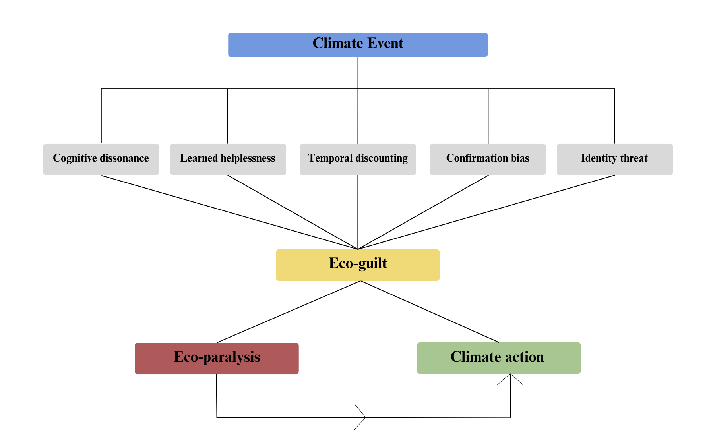

# Group 9 Executive Public Summary
**By Parth Arora, Jyot Adhvary, Aditya Misra, and Ayla Rana**

**November 12, 2024**

**ISCI 3A12**

## Eco-Guilt and Eco-Paralysis
Environmental challenges such as climate change, natural resource depletion, and biodiversity loss pose formidable threats to modern societies (Ágoston et al. 2022). While scientific and technical approaches are crucial, these problems necessitate a deeper understanding of the emotional responses they elicit from individuals (Ágoston et al. 2022). Eco-guilt, an emotion arising from the recognition of one’s contribution to environmental harm, serves as a moral regulator by driving introspection and self-censorship (Nielsen, Gamborg, and Lund 2024). This heightened awareness can inspire individual empowerment and drive climate action initiatives aimed at reducing personal and community impacts on the environment. However, excessive eco-guilt can escalate into eco-paralysis—a state of inaction rooted in feelings of helplessness. Emotional burnout caused by eco-paralysis exacerbates disengagement, emphasizing the importance of balancing these emotions effectively to sustain long-term action (Nielsen, Gamborg, and Lund 2024). 

##Exploring Psychological Barriers
This research investigates five core psychological barriers that contribute to climate inaction: cognitive dissonance, learned helplessness, temporal discounting, confirmation bias, and identity threat. Figure 1 visually represents the interplay between climate events, psychological barriers, and their influence on eco-guilt, highlighting the pathways that lead to either eco-paralysis or climate action.

*Figure 1: Diagram illustrating the progression of psychological and emotional responses stemming from a climate event. At the top layer, a climate event acts as the initial trigger, setting off cognitive and emotional processes. The second layer identifies five key psychological barriers—cognitive dissonance, learned helplessness, temporal discounting, confirmation bias, and identity threat—that influence how individuals process their role in environmental harm. These barriers contribute to the emergence of eco-guilt, depicted in the central layer, which serves as a moral response to perceived environmental responsibility. The final layer highlights two possible outcomes of eco-guilt: eco-paralysis, where overwhelming guilt leads to inaction, and climate action, where guilt is transformed into proactive efforts to reduce environmental harm.*

These barriers were selected based on three key criteria: prevalence in the literature, relevance to eco-guilt and/or eco-paralysis, and applicability in offering insights for intervention. The chosen barriers reflect a range of psychological and contextual dynamics that influence behavior, from individual cognition and decision-making to emotional responses and social identity. This multidimensional approach ensures that the analysis captures not only the internal psychological conflicts that eco-guilt may trigger, but also the broader contextual factors that shape collective climate action. Furthermore, through case studies, the article aims to explore whether communities that overcome these psychological barriers can transform eco-guilt into sustained climate action. The research seeks to assess the potential pathways for converting a paralyzing emotion into a driving force for long-term environmental solutions.

## Discussion 
The findings of this study shed light on the profound psychological barriers that inhibit the transition from eco-guilt to sustained climate action. The examined barriers contribute to eco-paralysis, while systemic shortcomings reinforce unsustainable behaviours, thereby amplifying feelings of futility. These findings highlight a troubling dynamic where individuals experience heightened awareness yet remain trapped in cycles of inaction, shaped by entrenched socio-political and economic systems. This interplay emphasizes the need to view eco-paralysis as a product of both personal and collective factors, rooted within broader societal structures that perpetuate climate inaction.

This research faces several limitations, particularly in its scope and methodology. A reliance on cross-sectional data provides only static snapshots of emotions, failing to capture the dynamic progression from eco-guilt to eco-paralysis. Additionally, much of the existing research is rooted in Western, individualistic perspectives, overlooking the dynamics of collectivist societies where climate action may be influenced by varying factors. These limitations result in an overrepresentation of data from the Global North, neglecting the cultural, geographic, and socio-economic factors that influence responses in underrepresented communities. To advance understanding, future studies must adopt more diverse, longitudinal, and culturally inclusive frameworks, ensuring that interventions are informed by a broader range of perspectives​.

## References
Ágoston, Csilla, Benedek Csaba, Bence Nagy, Zoltán Kőváry, Andrea Dúll, József Rácz, and Zsolt Demetrovics. 2022. “Identifying Types of Eco-Anxiety, Eco-Guilt, Eco-Grief, and Eco-Coping in a Climate-Sensitive Population: A Qualitative Study.” International Journal of Environmental Research and Public Health 19 (4): 2461. https://doi.org/10.3390/ijerph19042461.

Nielsen, Rikke Sigmer, Christian Gamborg, and Thomas Bøker Lund. 2024. “Eco-Guilt and Eco-Shame in Everyday Life: An Exploratory Study of the Experiences, Triggers, and Reactions.” Frontiers in Sustainability 5 (April). https://doi.org/10.3389/frsus.2024.1357656.
